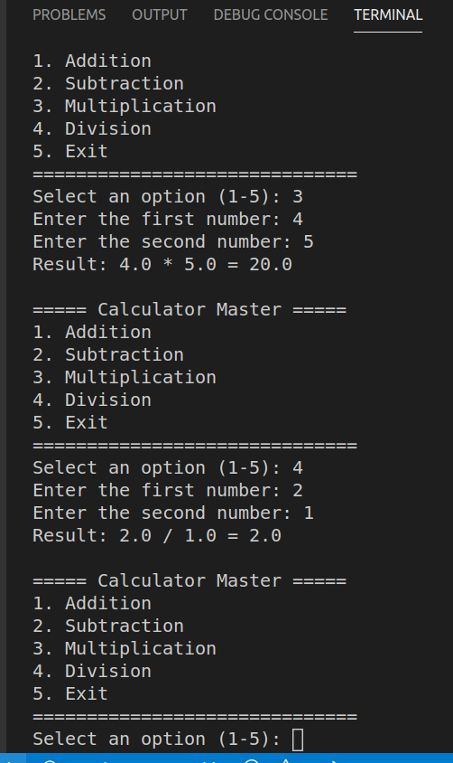

# Calculator Master

## Student Name
Aaron Cabanatan

## Course and Section
ITNT415 - BIT41

## Project Description
Calculator Master is a menu-driven Python calculator developed using
Git and GitHub feature-branch workflow. Each arithmetic operation
(addition, subtraction, multiplication, division) was developed on its
own branch, committed with descriptive messages, and merged into
`main` via a Pull Request. The final version integrates all four
operations into a single application with input validation and error
handling.

## Branch Structure
- `main` — integrated final calculator
- `addition_Cabanatan` — addition feature
- `subtraction_Cabanatan` — subtraction feature
- `multiplication_Cabanatan` — multiplication feature
- `division_Cabanatan` — division feature (includes divide-by-zero
  handling)

Each branch was merged into `main` through a reviewed and approved
Pull Request.

## Program Features
- Menu-driven interface (Addition, Subtraction, Multiplication, Division, Exit)
- Continuous execution until the user selects Exit
- Input validation (rejects non-numeric input and re-prompts)
- Division-by-zero handling with a clear error message
- Modular function definitions for each operation

## Sample Execution Screenshot

